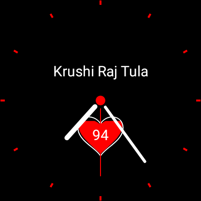

# Analog Watch Face - Wear OS
This is an analog watch face made by Krushi Raj Tula.

I recommend to go through the references I mentioned if you want to start/continue developement on top of this project.

References I used for building this are:
1. [Create a watchface for Wear with Kotlin - Codelabs](https://codelabs.developers.google.com/codelabs/watchface-kotlin/index.html#0)
1. [Build watch faces for Wear OS](https://proandroiddev.com/build-watch-faces-for-wear-os-44be9d536a9a)

Below is the screenshot directly taken from my Fossil Gen 5 Carlyle watch(round faced)


## To connect physical watch to android studio for debugging

> You can find these steps somewhere in the reference 1, but I wanted to make it simple and have it listed directly here.

1. Connect the phone to which the watch is paired via bluetooth using a USB cable
1. Turn on debugging via USB in phone
1. Open Wear OS companion app on you phone and under the advanced setting select *debugging over bluetooth*
1. You will see something like below
    ```bash
    Host: Disconnected
    Target: Connected
    ```
1. Execute the following commands to get it connected
    ```bash
    # the path specified below is path to Android SDK installation on windows
    # it can be different in your case based on the operating system
    # I'm changing directory to that path because I need to access adb command
    # If you readily have access to adb command ignore the cd command
    # and execute the next two commands
    cd "C:\Users\<username>\AppData\Local\Android\Sdk\platform-tools"
    adb forward tcp:4444 localabstract:/adb-hub
    adb connect 127.0.0.1:4444
    ```
    Now you should see the below in your phone, in advaced setting of Wear OS companion app.
    ```bash
    Host: Connected
    Target: Connected
    ```
1. Now you can see your watch under devices list in Android studio